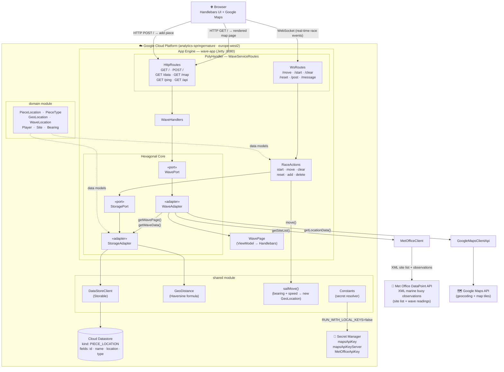

# Wave Mapper — Architecture Diagram

## Game Piece Types

| Type | Role |
|------|------|
| `BOAT` | Player vessels — moved each tick via `sailMove()` |
| `SHARK` | Hazard pieces on the map |
| `PIRATE` | Hazard pieces on the map |
| `START` | Newport, Rhode Island (41.29°N, 71.19°W) |
| `FINISH` | Lisbon (38.41°N, 9.09°W) |
| `WAVE` | Met Office buoy observation positions |

## Key Data Flows

1. **Page load** — `GET /` → `WaveAdapter.getWavePage()` fetches all `PieceLocation` entities from Datastore + live Met Office buoy positions → serialised to Google Maps JSON → rendered into `WavePage.hbs`
2. **Race tick** — WebSocket `/move` → `RaceActions.move()` → reads all `BOAT` pieces from Datastore → applies `sailMove()` (bearing + speed navigation) → writes updated positions back to Datastore → pushes new map state to browser over WS
3. **Race start** — `/start` → moves all boats to `START` position, adds `START`/`FINISH` markers
4. **Wave data** — `GET /data` → `MetOfficeClient.getSiteList()` → parses XML from Met Office DataPoint API → returns `WaveLocation` list

